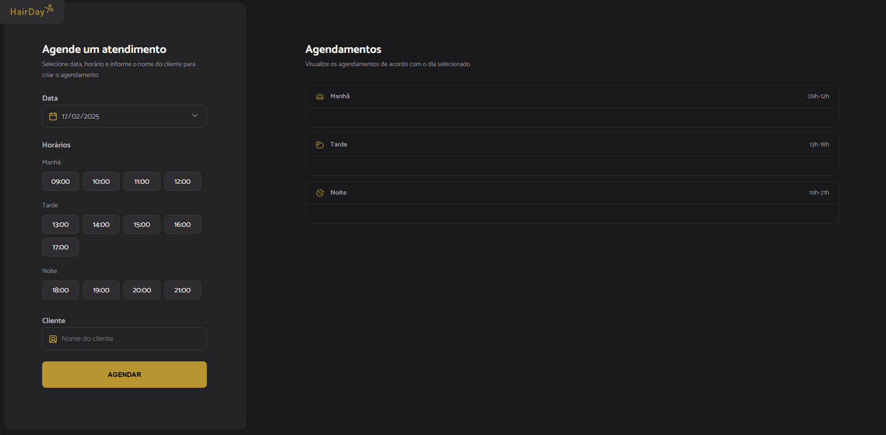

# Sistema de Agendamento para Barbearia

Este é um **projeto acadêmico** desenvolvido durante a **trilha de aprendizagem Full Stack**. O objetivo principal é criar um **sistema de agendamento de horários** para uma barbearia, permitindo aos clientes marcar horários de atendimento. Esse sistema pode ser facilmente adaptado para outras instituições, alterando apenas o logo e alguns textos.

A aplicação é dinâmica, responsiva e moderna, proporcionando uma experiência de usuário fluída. Foi desenvolvido utilizando **HTML**, **CSS**, **JavaScript** e **Figma** para o design. As funcionalidades principais incluem o agendamento de horários, visualização dos agendamentos e cancelamento, tudo com armazenamento local integrado à API.

## 🚀 Funcionalidades

- **Agendamento de Horários**: Permite que o cliente agende horários entre **09:00** e **21:00**, escolhendo a data de agendamento (somente para o dia atual ou futura).
- **Adicionar Nome do Cliente**: O nome do cliente pode ser inserido no momento do agendamento.
- **Cancelamento de Agendamento**: Permite que os agendamentos sejam cancelados facilmente.
- **Armazenamento Local**: Utiliza uma API local integrada com **json-server** para armazenar os agendamentos.
- **Visualização de Agendamentos**: Exibe os agendamentos feitos diretamente na aplicação web.
- **Design Responsivo e Moderno**: Adaptável a diferentes dispositivos.

## 🛠️ Tecnologias Utilizadas

- **HTML5**: Estruturação da página.
- **CSS3**: Estilização responsiva e moderna.
- **JavaScript**: Lógica do sistema e manipulação de dados.
- **Figma**: Design da interface do usuário.
- **GitHub**: Versionamento do código.
- **Vercel**: Deploy da aplicação online.
- **Day.js**: Manipulação e exibição das datas de agendamento.
- **Webpack**: Empacotamento e otimização de arquivos.
- **Babel**: Transpilação de código JavaScript moderno para compatibilidade com navegadores.
- **json-server**: API local para armazenamento de agendamentos.
- **copy-webpack-plugin**: Copia arquivos necessários durante o processo de build.
- **mini-css-extract-plugin**: Extrai o CSS em arquivos separados para otimizar a performance.

## 📂 Estrutura do Projeto

Estrutura de Pastas

```plaintext
sistema-de-agendamento/
│── dist/
│   ├── index.html
│   ├── main.css
│   ├── main.js
│   └── scissors.svg
│── node_modules/
│── src/
│   └── assets/
│   │   └── img/
│   │       └── screenshot.png
│   ├── css/
│   ├── js/
│   ├── libs/
│   ├── modules/
│   ├── services/
│   └── utils/
│── .gitignore
│── package.json
│── webpack.config.js
│── server.json
│── README.md
```

## 🔧 Como Executar o Projeto

1. Clone este repositório:

   ```bash
   git clone https://github.com/devmoisessantos/sistema-de-agendamento.git
   ```

2. Acesse a pasta do projeto:

   ```bash
   cd sistema-de-agendamento
   ```

3. Instale as dependências do projeto:

   ```bash
   npm install
   ```

4. Execute o projeto:

   ```bash
   npm run server
   ```

5. Abra o arquivo `index.html` no navegador.

## 🌎 Deploy

O projeto está disponível online: **[AQUI](https://sistema-de-agendamento.vercel.app/)**

---

## 📌 Melhorias Futuras

- Implementar um sistema de login para usuários.
- Adicionar notificações por e-mail para lembretes de agendamento.

## 🤝 Contribuição

Sinta-se à vontade para abrir issues e enviar pull requests para melhorias!

- Faça um fork do projeto.
- Crie uma nova branch para sua feature (`git checkout -b minha-feature`).
- Commit suas alterações (`git commit -am 'Adiciona nova feature'`).
- Envie para o repositório remoto (`git push origin minha-feature`).
- Abra um Pull Request.

---

## 🔗 Links

🔗 [LinkedIn](https://www.linkedin.com/in/devmoises-santos)  
🐙 [GitHub](https://github.com/devmoisessantos)  
📧 [Email](mailto:devmoisessantos@gmail.com)

📌 **Desenvolvido por Moisés M. Santos** 🚀
